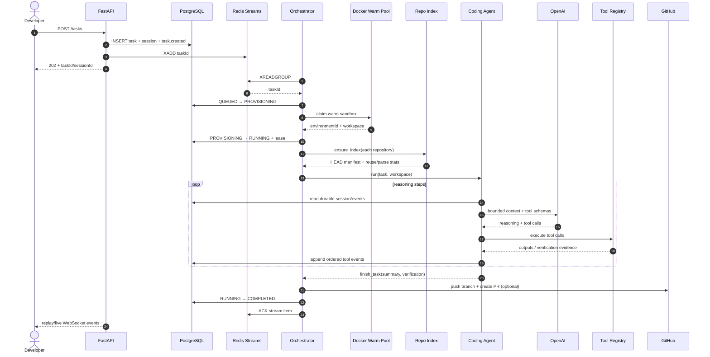
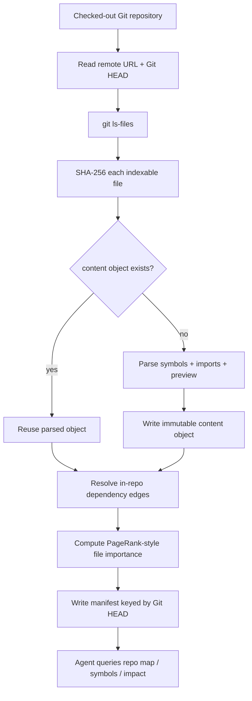
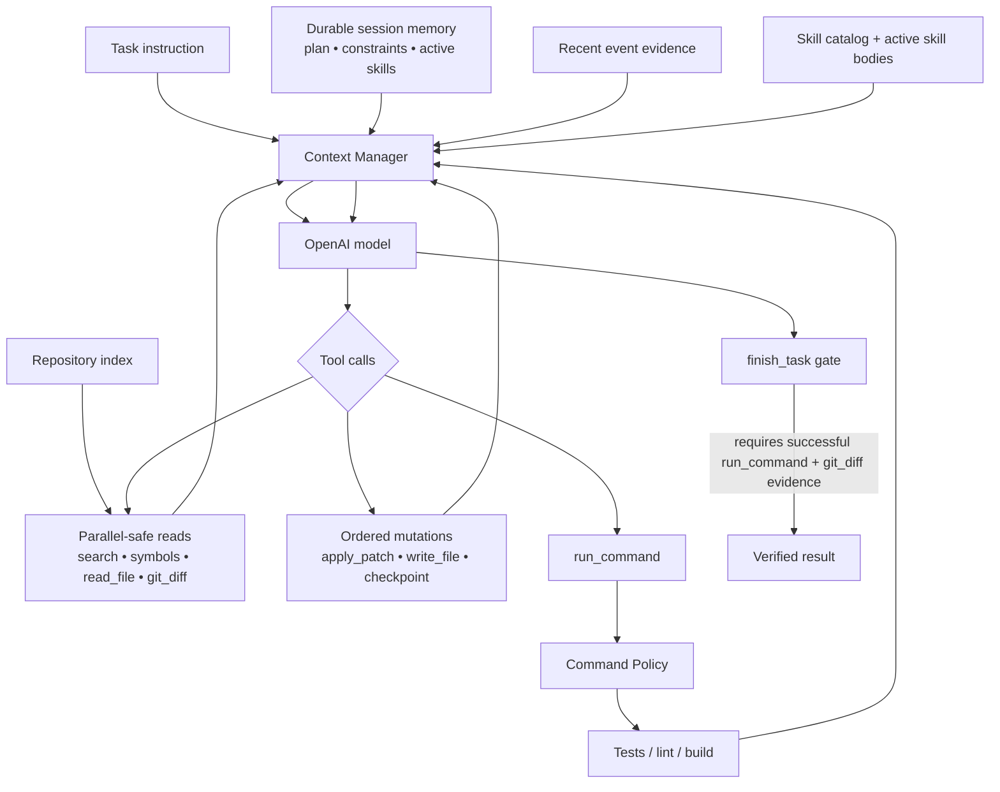
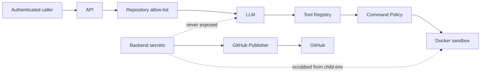
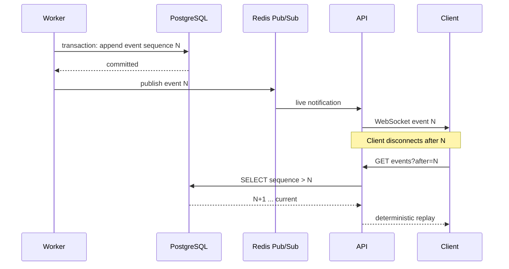
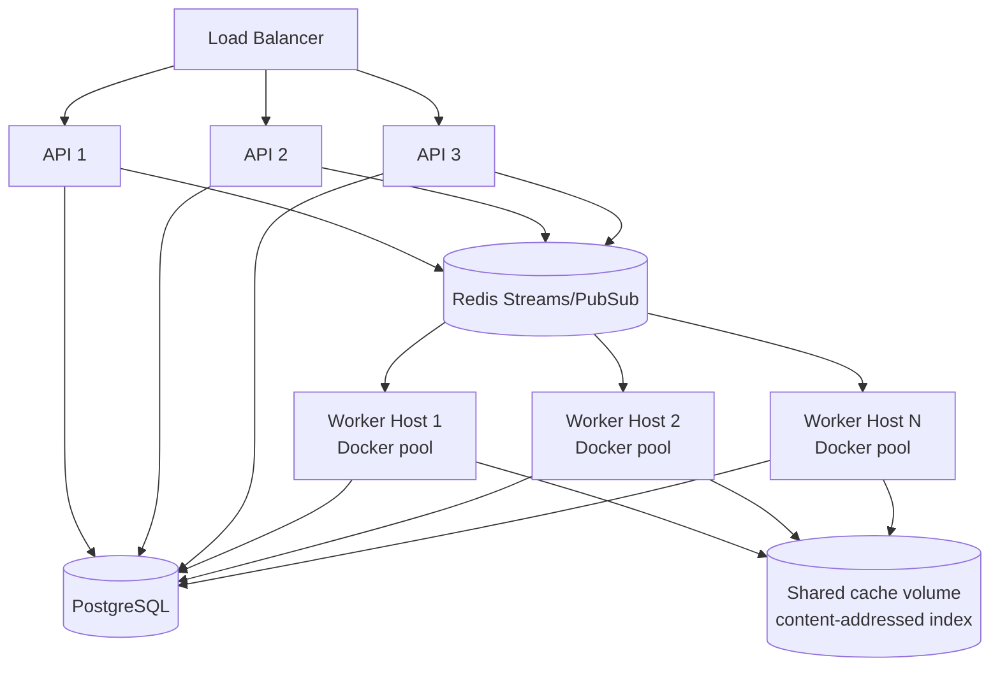

# Minion Production Reference Architecture

This document describes **one concrete architecture** for the repository. It is not
a menu of databases, queues or runtimes. The code keeps interfaces at boundaries for
testability, but this is the production story to present in an interview.

## Fixed production stack

| Concern | Selected technology | Why it owns this concern |
|---|---|---|
| API/control plane | **FastAPI + Uvicorn** | async task control, REST, WebSockets |
| Durable state | **PostgreSQL 16** | tasks, sessions, ordered events, environment leases |
| Work queue | **Redis 7 Streams** | consumer groups, ACK, stale-delivery reclaim |
| Live event fan-out | **Redis 7 Pub/Sub** | low-latency worker → API notifications |
| Agent model | **OpenAI tool-calling model** | reasoning/planning/tool selection |
| Execution isolation | **Docker warm sandbox pool** | isolated, reusable build/test environments |
| Source/PR system | **GitHub** | repository source of truth, task branches, PRs |
| Repository intelligence | **Content-addressed index on shared POSIX cache volume** | parse once per file content, ranked repo map |
| Durable code checkpoint | **Git commits** | recoverable code-state boundary |
| Schema changes | **Alembic** | versioned PostgreSQL migrations |
| Metrics | **Prometheus** | task/environment lifecycle metrics |

The reference deployment mounts the repository-index/cache directory on a shared
persistent POSIX volume. The application only requires filesystem semantics, so the
same content-addressed objects are reusable by multiple workers.

---

## System architecture

```mermaid
flowchart LR
    DEV["Developer / Web UI / CLI"]

    subgraph CP["CONTROL PLANE"]
        API["FastAPI API<br/>REST + WebSocket"]
        AUTH["Auth + Repository Policy"]
        ORCH["Orchestrator Worker Fleet<br/>N concurrent workers"]
        PG[("PostgreSQL 16<br/>Tasks • Sessions • Events • Leases")]
        REDIS[("Redis 7<br/>Streams + Pub/Sub")]
        PROM["Prometheus /metrics"]
    end

    subgraph EP["EXECUTION PLANE"]
        POOL["Docker Warm Pool<br/>M isolated containers"]
        WS["Task Workspace<br/>environmentId<br/>repo branches"]
        IDX["Repository Intelligence<br/>content objects + manifests<br/>dependency graph + ranking"]
        CACHE[("Shared Persistent Cache Volume<br/>repo mirrors • index • dependencies")]
        SKILL["Skill Manager<br/>built-in • user • repository skills"]
        CTX["Context Manager<br/>plan • constraints • skills • compacted history"]
        AGENT["Coding Agent Loop"]
        MODEL["OpenAI Tool-Calling Model"]
        TOOLS["Tool Registry<br/>index • files • patch • shell • Git"]
        POLICY["Deterministic Command Policy"]
    end

    GH["GitHub<br/>clone • push • pull request"]

    DEV -->|"1. POST task / message"| API
    API -->|"2. authenticate + authorize"| AUTH
    API -->|"3. commit task/session/event"| PG
    API -->|"4. XADD taskId"| REDIS

    REDIS -->|"5. XREADGROUP delivery"| ORCH
    ORCH -->|"6. read/transition task"| PG
    ORCH -->|"7. claim warm environment"| POOL
    POOL -->|"8. mount isolated slot"| WS

    WS -->|"9. repository HEAD/files"| IDX
    IDX <-->|"content-hash objects + HEAD manifest"| CACHE
    WS <-->|"Git mirror + dependency cache"| CACHE

    ORCH -->|"10. start runtime"| AGENT
    SKILL -->|"active skill instructions"| CTX
    PG -->|"session + recent ordered events"| CTX
    IDX -->|"ranked repo map / symbol evidence"| TOOLS
    CTX -->|"bounded prompt"| AGENT
    AGENT -->|"11. model request + tool schemas"| MODEL
    MODEL -->|"12. tool calls"| AGENT
    AGENT -->|"13. read-only calls may fan out"| TOOLS
    TOOLS -->|"14. shell command"| POLICY
    POLICY -->|"approved execution"| WS
    TOOLS -->|"file/patch/git operations"| WS

    AGENT -->|"15. durable evidence events"| PG
    PG -->|"16. committed event notification"| REDIS
    REDIS -->|"17. Pub/Sub live event"| API
    API -->|"18. WebSocket"| DEV

    WS -->|"checkpoint commit / branch"| GH
    ORCH -->|"19. backend-authenticated PR publish"| GH
    PROM -.->|"scrapes API/worker metrics"| API
    PROM -.->|"scrapes lifecycle metrics"| ORCH
```



### The important separation

The architecture has three different kinds of state:

```text
logical work                 durable understanding            physical execution
taskId                       sessionId                        environmentId
  │                              │                                │
  │ survives process crash       │ survives process crash         │ replaceable
  │ survives sandbox loss        │ survives sandbox loss          │ may be recreated
  ▼                              ▼                                ▼
PostgreSQL task row          PostgreSQL session + events      Docker workspace
```

A sandbox is **not** the task. A WebSocket connection is **not** the session. This
separation is what allows long-running work to recover.

---

## End-to-end task flow



---

## Repository intelligence: index once, reuse aggressively

Repository navigation happens **before the first model turn**.



### Cache semantics

For repository `R`:

```text
repository_index/
  <sha256(remote-url)>/
    objects/
      <sha256(file-bytes)>.json      # immutable parsed file facts
    manifests/
      <git-head>.json                # paths → content objects + graph + ranking
    latest.json
```

If a new commit modifies 3 files in a 50,000-file repository, only those **new file
contents** are parsed. Unchanged content objects are reused. A manifest is generated
once per Git HEAD.

The index is **derived state**. Losing it affects latency, not correctness; Git can
rebuild it.

---

## Agent runtime architecture



Read-only tool calls from one model turn may execute concurrently. Mutating calls are
kept sequential so edit order is deterministic.

---

## Agent Skills

Skills carry reusable engineering conventions without baking them into one enormous
system prompt.

```text
src/minion/builtin_skills/*/SKILL.md    built-in engineering skills
~/.minion/skills/*/SKILL.md             explicitly installed user skills
<repo>/.minion/skills/*/SKILL.md        repository/team instructions
```

Each skill has cheap YAML metadata (`name`, `description`, markers, keywords,
priority) and a Markdown body. Metadata is discovered first; full instructions are
injected only for active skills.

Precedence for the same skill name:

```text
repository skill  >  user skill  >  built-in skill
```

Repository skills are **data only**. They cannot import Python, spawn a process,
register hidden MCP servers, or bypass command policy merely because a repository was
opened.

---

## Safety and trust boundaries



Controls are layered:

1. API authentication.
2. Repository-host authorization.
3. Model receives structured tools, not raw backend capabilities.
4. Shell commands pass deterministic policy before execution.
5. Docker drops capabilities and applies memory/CPU/PID limits.
6. Child process environments remove model/GitHub/API credentials.
7. GitHub push/PR publication is a backend operation outside the agent shell.

---

## Event and recovery model

PostgreSQL is the replay source of truth. Redis Pub/Sub is never required for
correctness.



### Worker crash

Redis Streams keeps unacknowledged work pending. After the visibility timeout,
another consumer claims it. The fresh worker loads task/session state from PostgreSQL,
reattaches the preserved environment when possible, and otherwise allocates a new one.

### Model/API failure

The model call retries with bounded exponential backoff. Repository and session state
are unchanged.

### Sandbox failure

`taskId` and `sessionId` remain. `environmentId` is replaceable. Git checkpoint
commits and the durable event log provide the recovery boundary.

---

## Scaling model



Scale API replicas for user/event traffic, worker hosts for concurrent engineering
tasks, and warm-pool slots for execution concurrency. PostgreSQL/Redis remain shared
coordination services.

---

## Developer mode versus architecture

The code includes SQLite, an in-memory queue and a local environment provider because
tests should run without external services. They are **not separate architectural
choices**. The production architecture above is the canonical design.
