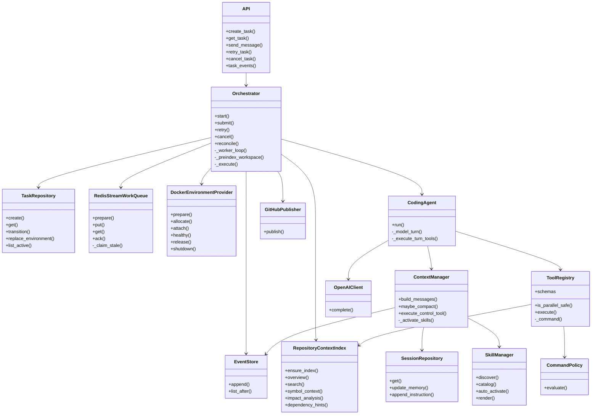
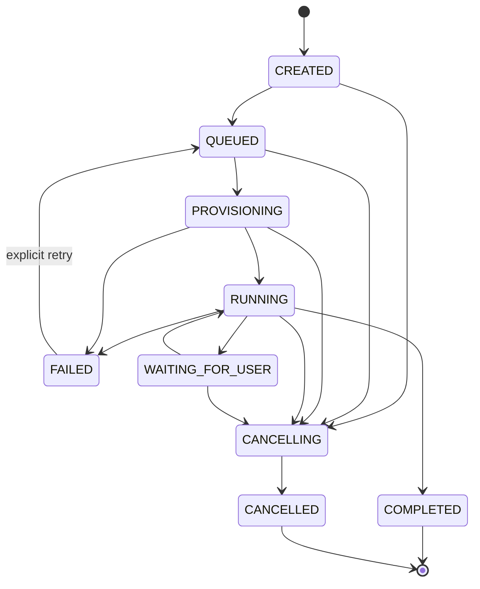
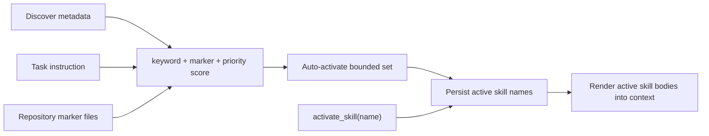
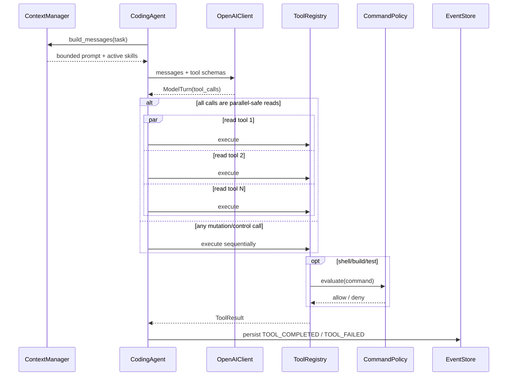

# Low-Level Design

This document maps every major architecture block to concrete classes, state and
runtime interactions in the repository.

## 1. Component map



---

## 2. Core IDs and ownership

| Field | Owner | Meaning | Recovery behavior |
|---|---|---|---|
| `task_id` | PostgreSQL `tasks` | logical requested work | never changes for a retry/recovery |
| `session_id` | PostgreSQL `agent_sessions` | learned/working state | persists across runtime restarts |
| `environment_id` | task + lease | physical sandbox/workspace | can be replaced |
| event `sequence` | `EventStore` | strict per-task replay order | monotonically increases |
| Git HEAD/checkpoint | task repository | durable code state | recoverable independently of model |

---

## 3. PostgreSQL schema

### `tasks`

```text
id PK
session_id UNIQUE
environment_id NULLABLE INDEX
user_id INDEX
instruction
status INDEX
repositories JSON
publish_pr
version
error
result JSON
created_at
updated_at
```

`version` is an optimistic concurrency token. A state transition updates only when
the expected version still matches.

### `agent_sessions`

```text
id PK
task_id UNIQUE FK -> tasks.id
summary
current_plan JSON
active_constraints JSON
active_skills JSON
last_event_sequence
created_at
updated_at
```

Only skill **names** are persisted. Skill bodies remain in skill files and are loaded
lazily, preventing large instruction bundles from being copied into every session
row/event.

### `events`

```text
id PK
task_id FK -> tasks.id
session_id INDEX
sequence
type INDEX
payload JSON
created_at
UNIQUE(task_id, sequence)
```

### `environment_leases`

```text
id PK                    # environment_id
task_id INDEX
provider
status INDEX
workspace_path
metadata JSON
last_heartbeat_at
created_at
updated_at
```

---

## 4. Task state machine



The queue is at-least-once, so duplicate delivery is not considered exceptional.
State checks plus optimistic updates decide whether work may proceed.

---

## 5. Orchestrator execution algorithm

```text
worker_loop:
    item = Redis Streams XREADGROUP / XAUTOCLAIM

    if task already running in this process:
        ACK duplicate local delivery
        continue

    execute(task_id):
        load durable task
        if terminal:
            return

        QUEUED -> PROVISIONING

        if task.environment_id exists:
            try attach(environment_id)

        if no healthy environment:
            allocate warm Docker slot
            persist new environment_id

        create/update environment lease
        PROVISIONING -> RUNNING

        start heartbeat coroutine

        for each repository concurrently:
            ensure content-addressed repository index
            append repository.indexed event

        build CodingAgent(workspace)
        append task.started
        result = agent.run(task)

        if publish_pr:
            backend pushes branch and creates PR

        RUNNING -> COMPLETED
        append task.completed

    ACK Redis stream item only after execute returns
```

A repository-index failure is recorded as `degraded` and does **not** fail the task;
the agent still has direct file/search tools.

---

## 6. Repository intelligence internals

### Persistent layout

```text
cache_root/repository_index/
  sha256(remote_url)/
    index.lock
    objects/
      sha256(file_bytes).json
    manifests/
      <git_head>.json
    latest.json
```

### File object

```json
{
  "path": "src/payment/service.py",
  "content_hash": "...",
  "size": 8312,
  "symbols": [
    {
      "name": "PaymentService",
      "kind": "class",
      "line": 42,
      "signature": "class PaymentService:"
    }
  ],
  "imports": ["domain.payment", "infra.kafka"],
  "preview": "first bounded source lines..."
}
```

### Manifest

```json
{
  "repository": "https://github.com/org/repo.git",
  "head": "<commit>",
  "files": {
    "src/payment/service.py": "<content hash>"
  },
  "facts": {},
  "dependency_edges": {
    "src/api.py": ["src/payment/service.py"]
  },
  "ranks": {
    "src/payment/service.py": 0.0421
  },
  "stats": {}
}
```

### Build algorithm

1. Read remote URL and HEAD.
2. If a manifest already exists for HEAD, return immediately.
3. `git ls-files`.
4. Ignore unsupported/binary/oversized files.
5. Hash file bytes.
6. Reuse an existing content object when the hash already exists.
7. Parse only unseen contents for symbols/imports.
8. Resolve import tokens to tracked repository files.
9. Build dependency adjacency.
10. Compute PageRank-style importance.
11. Atomically serialize the new HEAD manifest while protected by a file lock.

### Model-visible queries

| Tool | Purpose |
|---|---|
| `repository_overview` | ranked high-level repo map |
| `repository_search` | path/symbol/import/preview relevance |
| `symbol_context` | definitions + direct dependents/dependencies |
| `impact_analysis` | reverse dependency layers / blast radius |
| `dependency_hints` | imports and resolved local dependencies |
| `index_stats` | parse/reuse/coverage metrics |

The model should use these before broad recursive reads.

---

## 7. Agent Skills internals

### Skill file

```markdown
---
name: python-testing
description: Reliable Python changes with focused verification.
markers:
  - pyproject.toml
keywords:
  - python
  - pytest
priority: 20
---
Detailed reusable engineering instructions...
```

### Discovery scopes

```text
built-in:    src/minion/builtin_skills/*/SKILL.md
user:        ~/.minion/skills/*/SKILL.md
repository:  <repo>/.minion/skills/*/SKILL.md
```

Same-name precedence:

```text
repository > user > built-in
```

### Activation



`list_skills` returns metadata only. `activate_skill` persists a name. This avoids
injecting every skill body into every model call.

---

## 8. Context construction

At every model step:

```text
SYSTEM RULES
+
ORIGINAL TASK
+
DURABLE SESSION
  - summary
  - current_plan
  - active_constraints
  - active_skills
+
AVAILABLE SKILL METADATA
+
ACTIVE SKILL BODIES
+
RECENT DURABLE EVENTS
---------------------------------
bounded to context_max_chars
```

When the event sequence exceeds the compaction threshold, old relevant events are
condensed into `SessionRow.summary` while a recent window remains verbatim.

Compaction is not memory deletion: the full ordered event log remains in PostgreSQL.

---

## 9. Model/tool loop



Mutating tools are never parallelized because two edits racing on one worktree would
make results nondeterministic.

---

## 10. Editing model

For existing files, `apply_patch` is preferred:

```text
model proposes unified patch
        │
        ▼
write temporary .minion-agent.patch
        │
        ▼
git apply --check
        │
   success? ── no ──> return tool failure; source untouched
        │ yes
        ▼
git apply
        │
        ▼
delete temporary patch file
```

`write_file` remains useful for new/small complete files and enforces a size cap.

---

## 11. Shell execution safety

`run_command` never directly spawns the model string.

```text
LLM command
   ↓
CommandPolicy
   ├─ block privilege escalation
   ├─ block root/disk destructive operations
   ├─ block host lifecycle/mount commands
   ├─ block force push / git reset --hard
   └─ block system-path writes
   ↓ allowed
scrub credential environment
   ↓
Docker exec in task repository cwd
   ↓
timeout + bounded output
```

Docker adds another independent containment layer through dropped capabilities,
`no-new-privileges`, memory/CPU/PID limits and per-slot source mounts.

---

## 12. Completion gate

A model saying “done” is not enough.

`finish_task` checks the durable event history and refuses completion unless it can
prove:

1. at least one successful `run_command` verification occurred; and
2. a successful `git_diff` inspection occurred.

The model also supplies a human-readable verification list, but textual claims alone
do not satisfy the gate.

---

## 13. Queue semantics

Redis Streams:

```text
XADD task
  ↓
consumer group
  ↓
XREADGROUP
  ↓
worker owns pending entry
  ├─ completed execution → XACK + XDEL
  └─ worker crash
       ↓
     idle > visibility timeout
       ↓
     XAUTOCLAIM by another worker
```

This is intentionally **at least once**. Exactly-once behavior is constructed by
idempotent state, not promised by transport.

---

## 14. Event semantics

`EventStore.append()`:

1. lock/read the session row;
2. calculate `last_event_sequence + 1`;
3. insert event;
4. update session sequence;
5. commit SQL transaction;
6. publish the committed event via Redis Pub/Sub.

The database commit precedes fan-out.

---

## 15. Warm sandbox pool

Each warm slot has:

```text
Docker container
  /workspace -> dedicated host slot
  /root/.cache/pip -> shared dependency cache
  /root/.npm -> shared dependency cache
  /root/.m2 -> shared dependency cache
  /root/.gradle -> shared dependency cache
  /root/go/pkg/mod -> shared dependency cache
```

One warm container never mounts another slot's source tree.

When a failed task is released with `destroy_workspace=False`, its worktree is moved
to persistent workspace storage so retry/recovery can reattach it.

---

## 16. File-level implementation map

| Concern | File |
|---|---|
| external API/WebSocket | `src/minion/api.py` |
| task lifecycle | `src/minion/orchestrator.py` |
| valid transitions | `src/minion/state_machine.py` |
| work delivery | `src/minion/queue.py` |
| SQL schema | `src/minion/models.py` |
| SQL access | `src/minion/repositories.py` |
| durable events/live fan-out | `src/minion/events.py` |
| sandbox/warm pool/Git mirrors | `src/minion/runtime/workspace.py` |
| repository index | `src/minion/runtime/code_index.py` |
| skills | `src/minion/runtime/skills.py` |
| bounded context | `src/minion/runtime/context.py` |
| model loop | `src/minion/runtime/agent.py` |
| model adapter | `src/minion/runtime/llm.py` |
| model-visible tools | `src/minion/runtime/tools.py` |
| command safety | `src/minion/runtime/policy.py` |
| GitHub publication | `src/minion/github.py` |
| metrics | `src/minion/metrics.py` |


---

## 17. MCP integration

External tools are configured outside repositories:

```yaml
servers:
  engineering-search:
    url: https://mcp.example.com/mcp
    description: Internal engineering tools
```

`MCPManager` connects with the official MCP Python SDK, discovers `tools/list`,
and exposes each remote tool as `mcp__<server>__<tool>`.

The server-provided JSON Schema becomes the model tool schema. ToolRegistry routes a
namespaced call back through `MCPManager.call()`.

Trust rules:

- only the operator-owned config file can add servers;
- repository Skills cannot register MCP endpoints;
- non-loopback HTTP is rejected; remote endpoints require HTTPS;
- MCP tools are never marked parallel-safe because their side effects are unknown;
- MCP configuration is never injected into repository shell commands.
